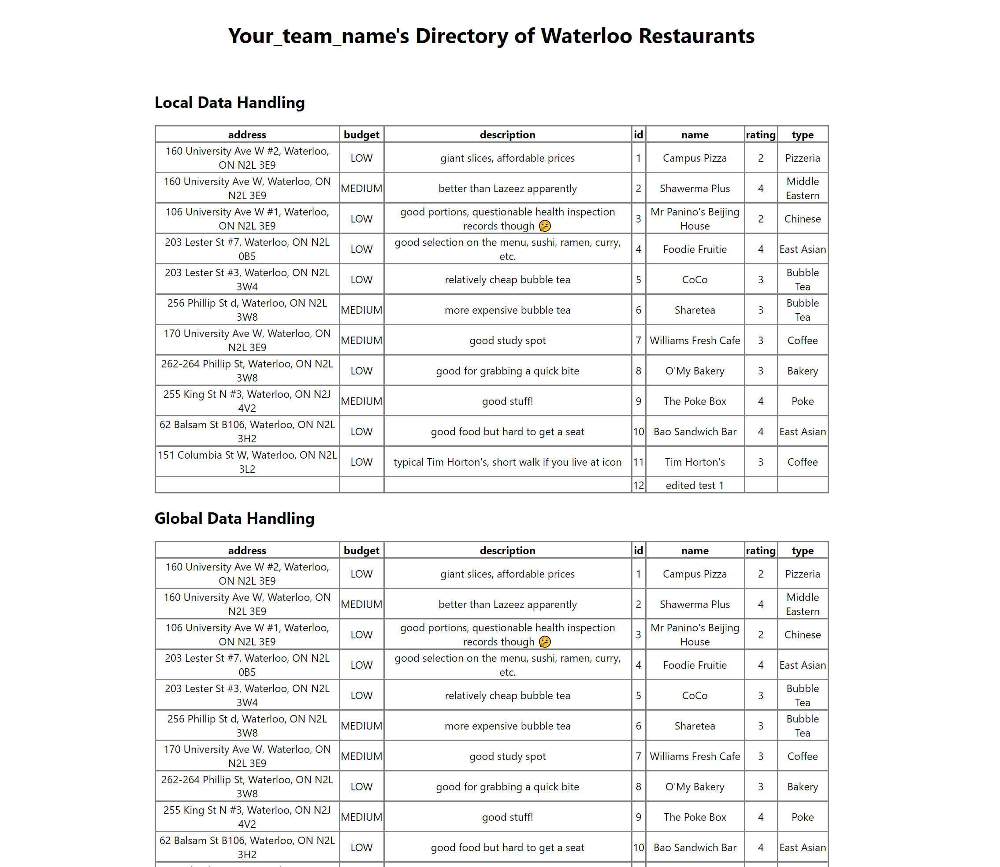

# Bootcamp: Python + Flask + React + PostgreSQL (REST API Backend)

This repo contains the starter-code for our bootcamp activity.

## Tech Stack

We will be using the Python + Flask + React + PostgreSQL stack. These technologies are easy to learn, allow for fast development speeds, and are popularly used in Blueprint.

* Frontend: React + Redux
* Backend: Python + Flask
* Database: PostgreSQL

## Setup

The dev environment is containerized with Docker to minimize setup efforts.

1. Install Docker Desktop (skip tutorials): [MacOS](https://docs.docker.com/docker-for-mac/install/) | [Windows (Home)](https://docs.docker.com/docker-for-windows/install-windows-home/) | [Windows (Pro, Enterprise, Education)](https://docs.docker.com/docker-for-windows/install/) | [Linux](https://docs.docker.com/engine/install/#server)
```bash
# verify your installation by running the following in a terminal
$ docker --version
$ docker-compose --version
```

2. Clone this repo and go into the project directory
```
$ git clone https://github.com/uwblueprint/bootcamp-pfrp-rest.git
$ cd bootcamp-prfp-rest
```

3. Fill in backend environment variables in `/backend/.env.sample`, then rename the file to `.env`. Tip: use `mv <old-filename> <new-filename>`
```
POSTGRES_DB=bootcamp
POSTGRES_USER=<insert-username-of-your-choice>
POSTGRES_PASSWORD=<insert-password-of-your-choice>
DB_HOST=bootcamp-pfrp-rest_db_1
FLASK_CONFIG=development
```

4. Set `erase_db_and_sync` to `True` in `backend/app/models/__init__.py` so the database will get seeded with test data when we run our application

5. Run the application
```
$ docker-compose up --build
```

6. Set `erase_db_and_sync` back to `False`.

7. Go to http://localhost:3000 in your browser. You should see this:



## Useful Commands for Development

To first setup the application run the following command:

```
$ docker-compose up --build
```

On subsequent runs you can omit the --build tag

```
$ docker-compose up
```

Keep in mind that both the frontend and backend have hot reload enabled so you will rarely need to restart the application.

## Warm Up

**Skip this if you are familiar with how to make HTTP Requests**

Before starting the tasks, let's try adding an entry to the existing Restaurant table. 

If we look at `backend/app/routes/restaurant_routes.py`, we can see each endpoint defined as its own function.

Reading the comments, if we want to create a restaurant, we will need to trigger the code in `create_restaurant()` by making a `POST` request to the *path* `/`. Note the path is relative to the root URL that we configured for this router, which is `/restaurants`, so the full path is actually `/restaurants/`. We can usually omit trailing "/"s in URLs.

If you look in the file `server.py`, you see that `app.run(..., port=5000)`, which tells us the server is listening for requests on *port* `5000`.

Since we are running this *locally*, we can put all these pieces of information together into one url: `http://localhost:5000/restaurants`.

Try downloading [Postman](https://www.postman.com/), and make a `POST` request to `http://localhost:5000/restaurants`. You can read the *Tip* section below or the documentation to learn more about Postman.

**Hint**: At this point, you may be wondering how will you specify the fields necessary to create a Restaurant. When we look at the code in `restaurant_routes.py`, we see a `RestaurantResource` being created to handle the HTTP request body (`request.json`). Try reading that & the comments associated.

## Your Tasks

Following the starter-code's pattern, complete these tasks:

Currently, our restaurant directory maintains a singular list of restaurants. 
Suppose we now want the ability to create restaurant groups (e.g. "Uni Plaza", "Cafes", "Open Late", etc.). 

A single group can contain multiple restaurants, and a single restaurant can be part of multiple groups.

A `RestaurantGroup` model should have these fields: `id`, `name`, `description`, `restaurantIds`*

\* implementation dependent, but the `RestaurantGroup` needs some way of keeping track of its members. **Hint: look into SQLAlchemy [relationships](https://docs.sqlalchemy.org/en/13/orm/relationships.html)**.

1. Using the existing code as a template, create REST endpoints for `RestaurantGroup`, supporting Create & Retrieve operations. 
    
    a. To support _creating_ groups, make an endpoint called `/groups` which handles a `POST` request. It will accept a `name`, `description`, and `restaurantIds` as the request body to create a new Restaurant Group. It will return an `id` which corresponds to the newly created Restaurant Group if successful

    **Sample Request Body**
    ```
        {
            "name" : "example_name",
            "description" : "example description",
            "restaurantIds" : [1, 2]
        }
    ```

    **Successful Response Body**
    ```
        {
            "id" : 1
        }
    ```

    b. To support _retrieving_ a group, make an endpoint called `/groups/<int:id>` which handles a `GET` request. It will accept an `id` as the request parameter and return the Restaurant Group data corresponding to that `id`
    
    **Sample Response Body** for `/groups/1`
    ```json
        {
            "id": 1,
            "name": "example_name",
            "description": "example description",
            "restaurantIds": [1, 2] // can return restaurantIds for now, but we will be expanding on this shortly
        }
    ```

2. Display `RestaurantGroup` data in the frontend (try to reuse existing components to save time, don't worry about design and appearance)

3. If you chose to only return `restaurantIds` in your GET response previously, modify your solution so that full restaurant information (i.e. member restaurants' names, ratings, descriptions, etc.) are included

### Tip

For some help with debugging your work, you can download [Postman](https://www.postman.com/)! Postman is a tool which allows developers to test endpoints with different requests, and view its responses. This will allow you to write and test the backend code without making any changes to the frontend yet.

And please **ASK FOR HELP**, if you're stuck!

### Extensions

1. To support _updating_ a group, make an endpoint called `/groups` which handles a `PUT` request. It will accept an `id`, `name`, `description`, and `restaurantIds` and edit the properties of the Restaurant Group with the corresponding `id`. It will return the `id` of the Restaurant Group if successful

2. Add an endpoint to delete `RestaurantGroups`

3. Modify the restaurant deletion logic so that deleting a restaurant will result in its removal from all the groups that it was part of
